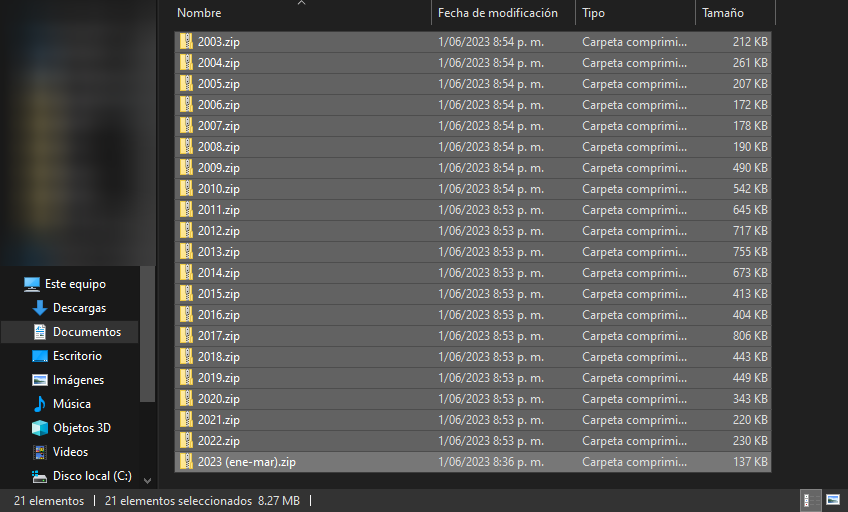
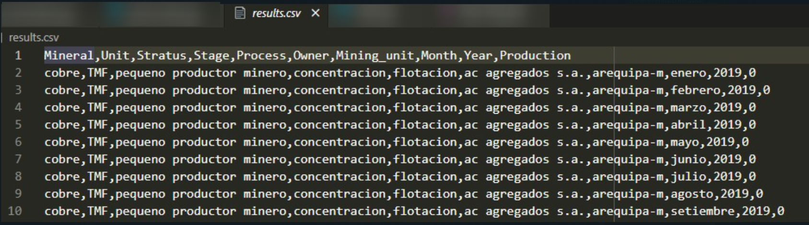
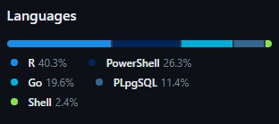

# Peruvian Mining history. 
## LinkedIn Article

> TL;DR 
> We take the data zipped by the MINEM, structured a database and an API using Go for easy interaction. 

### Motivation 
Everyone who had the chance to consult the Peruvian mining production reported by the Ministerio de Energia y Minas (MINEM onwards), had the challenge to work in a particular schema provided by the zip file given and the MSExcel(s) file(s) in it. Upon this, we also have to deal with several MSExcel format changes. This scenario makes an untraceable workflow, forcing US to do a lot of rework. In that sense, @Cesar and I saw the opportunity to produce a database and an API using top-notch technologies available to make this data accessible for all who want to know more about Peruvian mining production.  

### The journey
This project is outlined in Figure 1. In that picture, there are three things which are important to highlight: the data provided by the [MINEM website](www.minem.gob.pe), the database created and the API designed and implemented. Each actor represented a complex challenge to overcome. This is because the way how the MINEM has been presented the Peruvian Mining production has been evolving over time i.e. passing from .xls to .xlsx files, moving from format to format until what we have for 2022 and also mining companies ' changes such as its names and how they name their mining units over time. 

This phenomenon can be clearly noted in Figure 2. So, after a good time cleaning data, four CSV files were obtained which are the core of the database designed for this project. There, data modelling principles were applied in order to grant good scalability, and performance, avoiding redundancy. When this database was finally deployed and properly running, we asked ourselves which will be the best way to interact with it? The answer was in front of us all the time: an **[API](https://en.wikipedia.org/wiki/API)** 

    
    
    

A glimpse of what we can obtain with this tool is shown in Figure 3. In summary, you can use a link with the format depicted and obtain the Peruvian copper production in the most efficient, clear and clean way possible. This development opens a huge amount of possibilities such as the interaction with tools like PowerBI or even MSExcel to perform sound analysis with this data for all who are interested in knowing a bit more about this topic. Undoubtedly, this development will push the limits of the final user's creativity. We are also pretty sure that you will enjoy using it and learning more about it.

    
    

### Future Developments 
We have to be clear that what we have done so far is with the Peruvian copper mining production from 2003 to 2022. It means that there is a tonne to work to be done yet e.g. do the same thing with other relevant minerals such as gold, and silver, among others. On the other hand, we are currently looking for a server to locate this database and create an url that could be used for any who wants to use it. Finally, a clever way to update data for the next periods must be discussed ASAP. In conclusion, we are open to suggestions, collaboration and why not? collaborate with the MINEM in order to share developments for the benefit of the Peruvian society.

### Conclusions
A new way to get access to Peruvian mining production has been developed. It was thinking for any mining professional, student or professor can use it and apply its knowledge. We are pretty aware that there is still a lot of work to be done, however, we want to share it looking for further ideas and comments on how to enhance it. 
Finally, we also know that other Peruvian ministries (e.g. MEF) have their own API for making this kind of request. Please, see this development as our contribution to the Peruvian mining industry and all the people who are involved in it.

PS. If want to have an idea of what we have used, Figure 4 can give you an idea. 

    

## LinkedIn Post
Search for the mining Peruvian production is challenging. Whilst, this data is free and available for all, the level of complexity of this challenge will increase depending on the timeframe used for the research. This is mainly because of file formats used and how the data is presented (and changed) during the years. With this in mind, @Cesar and I decided to do something with that. Now, we are proud to share with you the version 0.1 of the first Peruvian API dedicated integrally to mining production. Please, take a look at the following article. We are open to discussing this topic and, with that, achieve that change in the Peruvian Mining Industry that we want to see. 